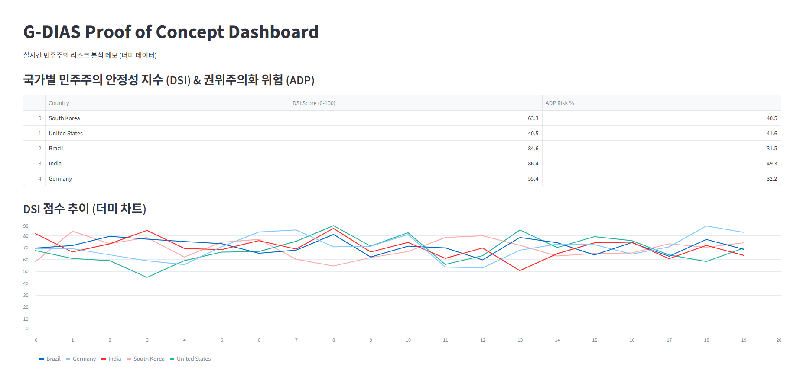

# G-DIAS PoC (Global Democratic Integrity Automated System Prototype)

**Real-time, bias-free global democratic risk analysis system**

목적: 민주주의 후퇴 조기 경보를 위한 완전 자동 분석 시스템

핵심 특징:
- 100% quantitative data (설문·전문가 판단 배제)
- Human-Free (인간 개입 완전 제거)
- Real-time 스트리밍 처리
- Open-source & 투명성 (코드·로그 공개)

현재 상태: PoC 단계
- 샘플 데이터 ingestion (Kafka)
- 기본 DSI 계산 (XGBoost)
- Streamlit 대시보드 시각화

## Demo

**대시보드 실행**:

streamlit run dashboard.py

브라우저에서 http://localhost:8501 열림 (Streamlit 서버 실행 중일 때만 동작)

**분석기 실행** (Kafka 데이터 처리):

python analyzer.py
Kafka 토픽에 데이터 넣으면 DSI 점수 출력

## How to Run the Demo

1. 의존성 설치 (한 번만)

pip install streamlit pandas numpy scikit-learn xgboost joblib kafka-python
2. 더미 모델 생성 (필요 시)

python train_and_save_dummy_model.py
3. Docker + Kafka 실행 (선택)

docker-compose up -d

## 설치 및 실행 방법 요약

- 의존성 설치: `pip install kafka-python pandas xgboost joblib scikit-learn streamlit`
- 모델 생성: `python train_and_save_dummy_model.py`
- 대시보드 실행: `streamlit run dashboard.py`
- 분석기 실행: `python analyzer.py`

## 아키텍처 다이어그램

  
(draw.io로 그린 이미지 – 실제 파일 첨부하세요)

## Demo Screenshot

## 다음 단계
- V-Dem 데이터셋 통합
- 실시간 Kafka 스트림 완성
- 오픈소스 커뮤니티 기여 유치

이 PoC는 Mozilla Democracy x AI Cohort 2026 제출용 프로토타입입니다.  
피드백 환영합니다!
